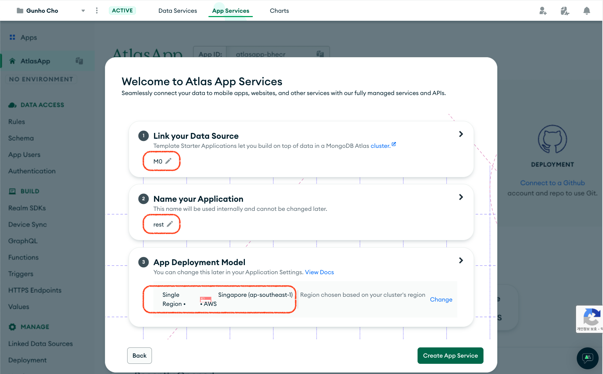
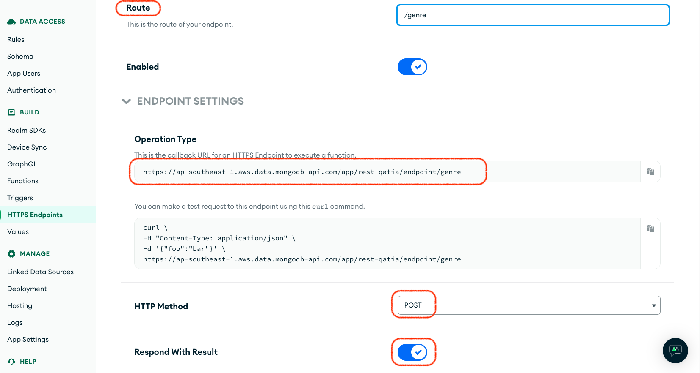
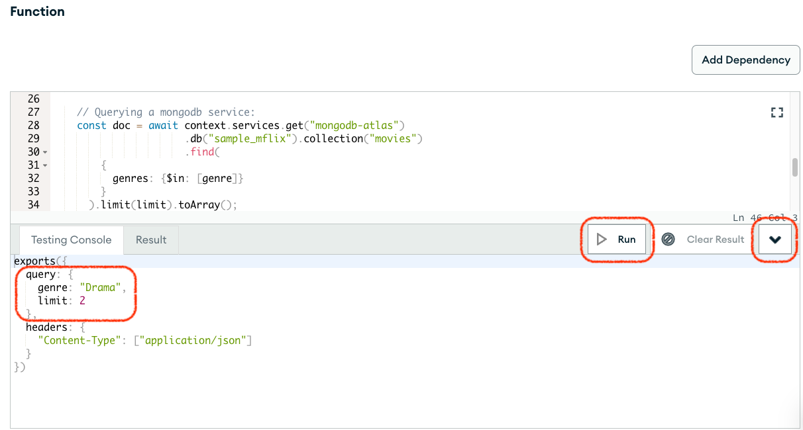
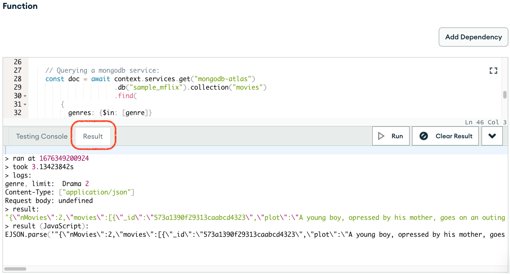
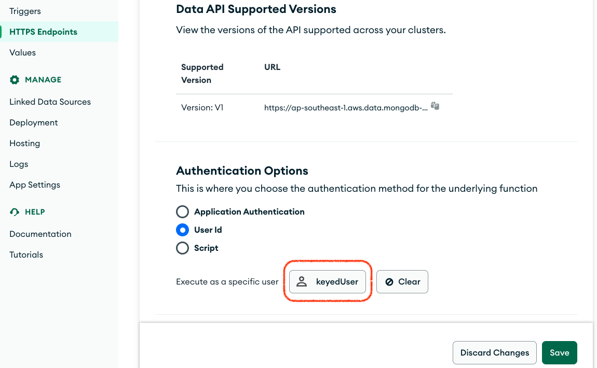

# Data API(RESTful API) & Functions

### [&rarr; Create App Service](#create-app-service)

### [&rarr; Data API](#data-api)

### [&rarr; Functions](#functions)

### [&rarr; Chage-Up](#change-up)

<br>

# Create App Service

- [App 시작](#app-시작)
- [App 환경 설정](#app-환경-설정-optional)
- [인증 활성화](#authentication)
- [Rule 변경](#authorization)

> 이미 App Service를 생성한 경우, 이 과정은 건너뛰고 [Data API](#data-api)부터 시작  
> &nbsp;

## App 시작


- Atlas UI 상단의 `App Services`탭 지입 후
- `Build your own App` 선택
- `Next` 클릭
  > Atlas UI 좌측 `Data API` 메뉴에서 시작할 수도 있다

<br>



- App Service의 데이터 소스(클러스터) 지정
- Application 이름
- CP와 리전 결정 후
  > 현재, App Service에 한국 리전은 제공되지 않는다  
  > Global region: 서비스 설정은 선택한 리전에 저장되지만, request는 요청한 클라이언트의 인접 리전에서 서비스  
  > Single region: 모든 request는 지정한 리전에서만 처리
- `Create App Service` 클릭
- `Welcome to your Application Guides`가 보인다면 그냥 무시(`Close Guides`)

<br>


- App dashboard에서 `App ID`를 확인할 수 있다 (Data API endpioint에 사용)

## App 환경 설정 (optional)

> 새로 생성된 App은 환경이 설정돼 있지 않다  
> App의 성격에 따라 다른 환경 변수들을 설정하고 개발에 이용할 수 있다
>
> - Testing
> - Development
> - QA
> - Production
>   &nbsp;  
>   &nbsp;

- `NO ENVIRONMENT` 클릭

<br>


- 환경 설정 후 (eg. `Testing`)
- `Save Draft` 클릭
- `Understanding Save and Deploy` 모달에서 `Next` 클릭
- `Got it` 클릭

<br>


- `REVIEW DRAFT & DEPLOY` 클릭
- `Deployment Draft` 모달에서 `Deploy` 클릭

<br>


- 상단의 `Deployment was successful!` 배너와
- 좌측 Apps 메뉴에서 `TEST` 환경 변경됨을 확인

## Authentication


- 좌측 `Authentication` 메뉴 진입 후
- 테스트에 가장 만만한 `API Keys`의 `EDIT` 버튼 클릭하여
- `Provider Enabled` 활성화
- `Save Draft` 클릭

<br>


- 상단의 `REVIEW DRAFT & DEPLOY` 클릭
- 이후 나타난 `Deployment Draft` 모달에서 `Deploy` 클릭
- 상단에 `Deployment was successful!` 확인 후 `Create API Key` 클릭

<br>


- `Add New API Key` 모달에서 `Api Key Name` 지정 (eg. `keyedUser`)
- `Create` 클릭

<br>


- API Key는 다시 확인할 수가 없기 때문에 반드시 생성 후 암기해야 한다
- 혹은, 가끔 암기력이 떨어지는 사람은 복사하여 안전한 장소에 저장하고는 그 사실을 완전히 잊어버리고 항상 새 키를 생성하기도 한다 (본인이면 손~)

## Authorization

> 셋업 시 모든 데이터 소스를 연결했지만 기본 authorization은 모두 `denyAllAccess`이기 때문에  
> I/O를 허용하려면 collection 별로 `Rule` 변경이 필요하다  
> <br>

<br>


- 좌측 `Rules` 메뉴 진입 후
- `sameple_mflix.movies` collection 선택
- 기본 `denyAllAccess`를 `readAll`로 변경 후
- `Add preset role` 클릭

<br>


- Rule이 `0.readAll` 로 변경 확인 후
- 상단의 `REVIEW DRAFT & DEPLOY` 클릭 후
- 활성화 된 `Deployment Draft` 모달에서 `Deploy` 클릭 후
- 잠시 후 상단에서 `Deployment was successful` 확인

# Data API

> **Requisites**
>
> > [[App Service]](#create-app-service)  
> > [[Postman]](https://www.postman.com/downloads/)
>
> 테스트는 Bearer token 방식 인증을 사용하지않기 때문에 [[Postman web]](https://web.postman.co) 버전을 사용할 수 없다  
> 반드시 로컬 설치버전 필요!!
> <br>

<br>

- [Data API 시작](#enable-data-api)
- [Postman 셋업](#postman)
- [테스트](#run-data-api)

<br>

> [[Data API 공식 매뉴얼]](https://www.mongodb.com/docs/atlas/app-services/data-api/)

## Enable Data API

<br>


- 좌측 Apps 내비게이션 패널에서 `HTTPS Endpoints` 메뉴 진입
- 상단 `Data API` 탭 선택 후
- 아래 `Enable the Data API` 클릭

<br>


- Endpoint URL가 단일 리전용 `https://<Region>.aws.data.mongodb-api.com/app/<App ID>/endpoint`임을 확인
- Leave all settings unchanged but
- Check `Create User Upon Authentication`
- `Save` 클릭 후
- `REVIEW DRAFT & DEPLOY` 클릭

<br>


- 검토 후 `Deploy` 클릭
- 상단의 `Deployment was successful!` 배너 확인

## Postman

<br>


- Postman에서 새로운 워크스페이스 생성

<br>


- 새로 생성된 워크스페이스에서 `Import` 클릭

<br>


- 제공된 Atlast Training repo의 `postman` 폴더 오픈

<br>


- 제공된 Collections, Global env 모두 선택
- `Import` 클릭

<br>


- Import된 설정에서 `Environment` - `Globals` 환경변수 중  
  `appId`, `region`, `apiKey` 가 현재 App Service의 설정 값과 동일한지 확인

## Run Data API

<br>


- `auth-apiKey` collection의 `findOne` request를 실행(`Send`) 후 결과 확인
- 다른 두 requests (`find`, `aggregate`)도 실행 후 결과를 확인한다

# Functions

<br>

- [Custom HTTPs Endpoints 설정](#https-endpoints)
- [Function 정의](#new-funtion)
- [Function 테스트](#query-custom-endpoint)

<br>

> [[Data API 공식 매뉴얼]](https://www.mongodb.com/docs/atlas/app-services/data-api/custom-endpoints/)  
> [[Functions 공식 매뉴얼]](https://www.mongodb.com/docs/atlas/app-services/functions/)

## HTTPs Endpoints


- 좌측 내비게이션 메뉴의 `HTTPS Endpoints` 진입 후
- `Add An Endpoint` 클릭

<br>

#### 

- `Route`로 `/genre` 지정
- Endpoint가 Route를 포함한 단일 리전 URL임을 확인  
  `https://<Region>.aws.data.mongodb-api.com/app/<App ID>/endpoint/<Route>`
- `HTTP Method`로 Data API와 동일하게 `POST` 사용
- `Respond With Result`를 켠다

<br>

#### 

- `+ New Function` 선택
  > App Service 전체 메뉴 `Functions`에서 임의의 함수를 추가할 수도 있지만  
  > Custom HTTPs endpoint의 경우 https function template이 제공된다
- `Function Name`을 `getMoviesByGenre`로 지정 후
- `Function` body를 아래 코드로 교체한다

  ```
  // This function is the endpoint's request handler.
  exports = async function({ query, headers, body}, response) {
      let {genre, limit} = query;

      if (limit === undefined) {
        limit = 5;
      } else {
        limit = parseInt(limit)
      }

      const contentTypes = headers["Content-Type"];
      const reqBody = body;

      console.log("genre, limit: ", genre, limit);
      console.log("Content-Type:", JSON.stringify(contentTypes));
      console.log("Request body:", reqBody);

      const doc = await context.services.get("mongodb-atlas")
                        .db("sample_mflix").collection("movies")
                        .find(
          {
            genres: {$in: [genre]}
          }
        ).limit(limit).toArray();
      const res = {
        nMovies: doc.length,
        movies: doc
      }

      return  res;
  };
  ```

<br>



- 오른쪽 아래 화살표 버튼을 클릭해서 `Testing Console`을 활성화 시킨 후
- 테스트를 위한 query param을 세팅하고
- `Run` 클릭

  > Testing console을 이용한 테스트 시 [[Example]](https://www.mongodb.com/docs/atlas/app-services/data-api/custom-endpoints/#example) 처럼 `response.setBody()`를 이용해 return대신 직접 body에 결과를 처리하려면 `HTTPResponse` instance를 function에 argument로 넘겨줘야 한다  
  > **예**
  >
  > ```
  > exports(
  >   {
  >      query {
  >        genre: 'Drama', limit: 1
  >      },
  >      headers: {'Content-Type': 'application/json'}
  >   },
  >   new HTTPResponse()
  > )
  > ```
  >
  > request body를 Testing console에서 export하려면 아래 예제처럼 [`BSON.Binary.fromBase64`](https://www.mongodb.com/docs/atlas/app-services/functions/globals/#mongodb-method-BSON.Binary.fromBase64)를 이용할 수 있다
  >
  > ```
  > exports(
  >   {
  >      query {
  >        genre: 'Drama', limit: 1
  >      },
  >      headers: {'Content-Type': 'application/json'},
  >      body: BSON.Binary.fromBase64(<base64 string value>)
  >   },
  >   new HTTPResponse()
  > )
  > ```
  >
  > 단, Testing console은 `btoa()`를 지원하지 않기 때문에 콘솔에서 직접 base64 string으로 전환할 수가 없기 때문에 `<base64 string value>`는 외부에서 변환해야 한다
  >
  > **예**
  >
  > `btoa(JSON.stringify(<json object>)) + "="`
  >
  > > `"="`: `BSON.Binary`에서 요구하는 padding 값

<br>



- `Result` 탭에서 기대했던 결과 확인

<br>


- `Fetch Custom User Data`와
- `Create User Upon Authentication`을 enable 시킨 후
- `Save Draft` 클릭

<br>

- 상단 `REVIEW DRAFT & DEPLOY` 배너 버튼을 클릭 후

<br>

- `Deployment Draft` 모달에서 최종 검토를 하고
- 모달 오른쪽 아래 `Deploy` 버튼 클릭

<br>

- 상단에 `Deployment was successful!` 배너가 나오면 성공

## Query Custom Endpoint


- Postman Collection `customHTTPsEndpoint`의 `genre` request를 실행한다
- query param, `genra`, `limit` 을 변경해서 검색 조건을 변경할 수 있다

<br>

# Change Up

- [User ID Authentication Method](#auth-user-id)
- [Unauthroized Request Test](#unauthorized-request)
- [Rules Filters](#filters)

<br>

## Auth User Id

지금까지의 테스트는 `apiKey`를 사용한 사용자 인증을 사용해왔다  
DATA API/HTTPs Endpoin는 기본 application authentication 외에  
모듈이 자체적으로 사용하는 사용자 인증 방법이 지원된다

- User Id
- Script

이번 테스트에서는 클라이언트가 사용자 인증을 하지 않고  
DATA API가 모든 query에 대해 사용자를 지정하는 인증 `User Id` 인증 방식을 테스트 해본다

<br>


- Postman `unauth-apiKey` collection에서 임의의 query를 수행한다
  > 해당 collection의 모든 query는 HTTP header에 인증을 위한 `apiKey`를 포함하지 않는다
- 결과는 `no authentication methods were specified` 임을 확인할 수 있다

<br>


- App Service 좌측 내비게이션 바에서 `HTTPS Endpoints`를 선택 후
- `Authentication Options`에서 `User Id`를 선택한다
- 아래 `Select User` 클릭

<br>


- 모달에서 등록돼 있는 사용자를 지정 후
- `Select User` 클릭

<br>



- 돌아온 설정에서 선택한 사용자(예. `keyedUser`)가 올바로 선택됐음을 확인 후
- `Save` 클릭

<br>


- 다시 Postman에서 동일한 query를 실행하면 인증이 성공해서 쿼리 결과를 확인할 수 있다
- 남은 모든 query도 인증 문제없이 수행됨을 확인하다

## Unauthorized Request


> App Service를 통한 DB query는 Rules의 Role에 기반한 RBAC로 제어된다  
> `sample_mflix` DB에서 `movies` collection외에는 Rule을 따로 지정하지 않았다  
> 즉, 다른 collection들은 모두 기본 Role인 `denyAllAccess`로 남아 있다  
> 이 상태에서 query request를 하게되면...


- Postman `auth-apiKey` collection에서 `find_Unauthorized` 를 실행하면
- apiKey를 사용해 인증은 성공하지만 `no rule exists` 에러를 확인할 수 있다
  > query는 `users` collection 대상의 request

## Filters

App Service의 Rules는 Role에 기반한 collection 수준의 접근제어와 함계  
Filter를 이용한 정밀한 document 접근 제어와 document의 field 접근제어가 가능하다

<br>


- App Service 좌측 내비메뉴에서 `DATA ACCESS` 아래 `Rules` 진입
- `sample_mflix.movies` 선택
- `Filter` 탭 선택 후
- `Add a filter` 클릭

<br>


- `Filter name` 지정 (eg. `familyMovies`)
- `Apply When` 지정
  ```
  {
    "%%user.custom_data.age": {
      "$exists": false
    }
  }
  ```
  > Filter 적용 조건을 정한다
  > `{}`: always true (alway apply)
  >
  > 테스트에서 `custom_data`를 설정하지 않았기 때문에 조건은 항상 true  
  > [[Rule Expressions 참조]](https://www.mongodb.com/docs/atlas/app-services/rules/expressions/#rule-expressions)
- `Query` 입력
  ```
  {
    "rated": {"$ne": "R"}
  }
  ```
  > `find` 조회 query에서 사용하는 filter pattern 사용  
  > `{}`: 모든 documents
  >
  > 성인 등급 영상을 제외하는 조건
- `Projection` 입력
  ```
  {
    "_id": 0,
    "title": 1,
    "plot": 1,
    "imdb": 1,
    "genres": 1
  }
  ```
- `Save Draft` 클릭
- 상단의 `REVIEW DRAFT & DEPLOY` 클릭

<br>

- `Deploy` 클릭

<br>

- 상단에 `Deployment was successful!` 확인되면 성공

<br>


- Postman `auth-apiKey` collection의 `findNoFilter` 수행
  > query는 `"filter"` 필드를 지정하지 않았지만
- 결과는 Rules의 Filter에저 지정한 `Projection`에 따라 한정된 필드만을 반환한다

<br>


- Postman에서 `findRratedMovies` query 수행
- query는 `"R"` 등급의 모든 영화를 찾으려 하지만 App Service Filter에 의해 모두 걸러진 후이기 때문에 검색되는 document가 없다
