# Data Federation & Online Archive Hands-on

### [&rarr; Data Federation](#data-federation)

### [&rarr; Online Archive](#online-archive)

<br>

# Data Federation

- [Federation Instance 생성](#federation-instance-생성)
- [Hot Storage 추가](#hot-storage-추가)
- [Cold Storage 추가](#cold-storage-추가)
- [Federated Query 시험](#federated-query-시험)

> [ [Data Federation 공식 매뉴얼](https://www.mongodb.com/docs/atlas/data-federation/overview/) ]

## Federation Instance 생성

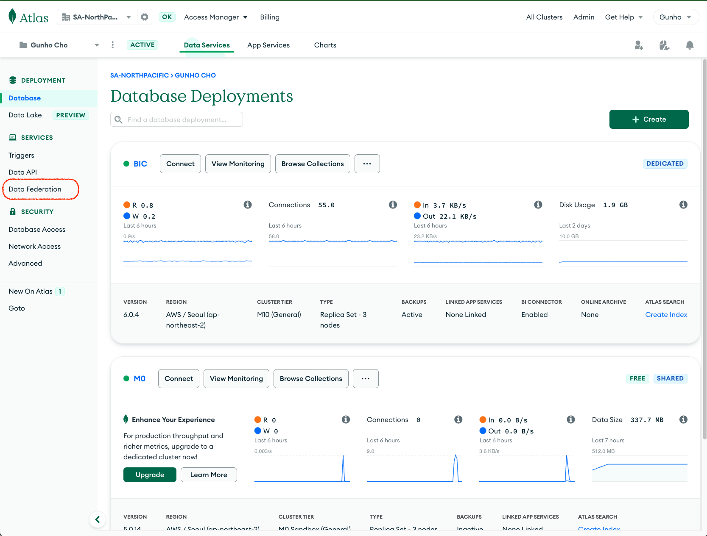

- [Atlas UI](https://cloud.mongodb.com) 로그인 후 왼쪽 `SERVICES` 메뉴의 `Data Federation` 으로 진입

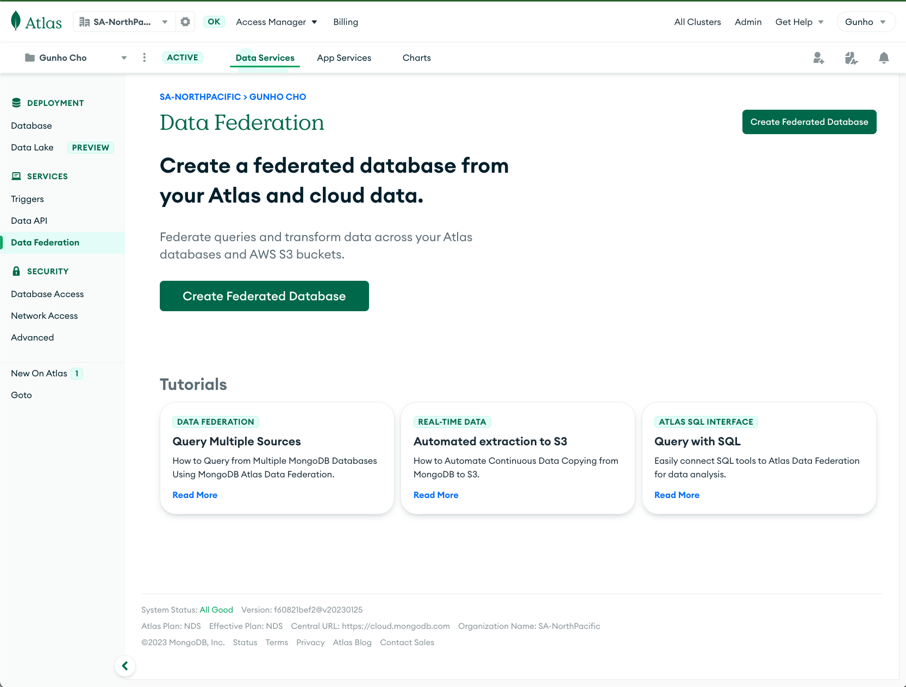

- `Create Federated Database` 클릭

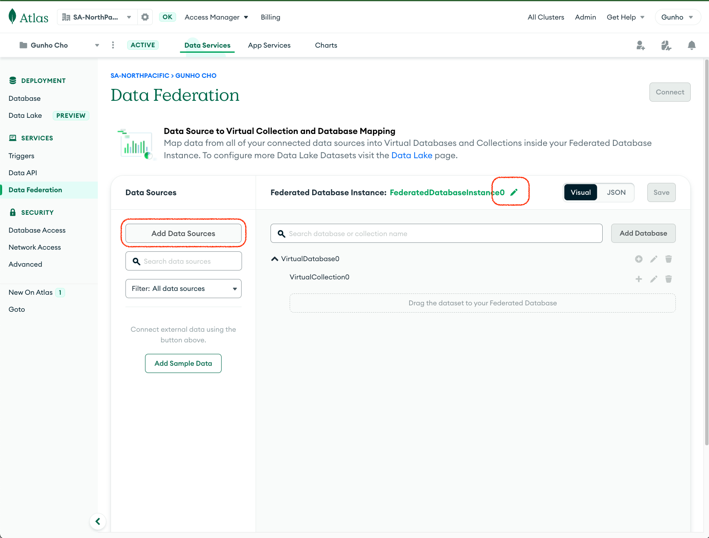

- Instance 정보 변경
  - `FederatedDatabaseInstance0` 이름 변경
    > 예) `fdb0`
- `Add Data Sources` 클릭

## Hot Storage 연결

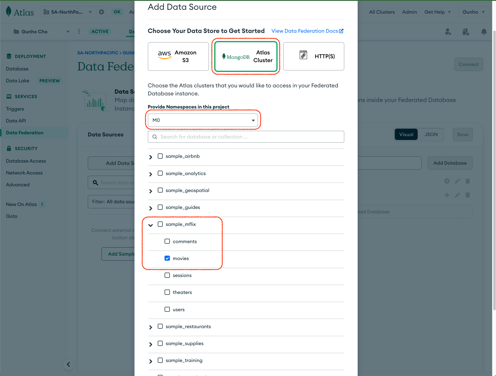

- `Atlas Cluster` 선택
- 운영중인 클러스터 선택
- 클러스터 내의 database와 collection 선택 (예: `sample_mflix.movies`)
  > 샘플 데이터 준비는 [pre-work](https://github.com/MongoDBAtlas/MongoDBAtlasTraining/tree/main/00.pre-work#%EC%B4%88%EA%B8%B0-%EB%8D%B0%EC%9D%B4%ED%84%B0-%EB%A1%9C%EB%93%9C) 참조
- `Next` 클릭

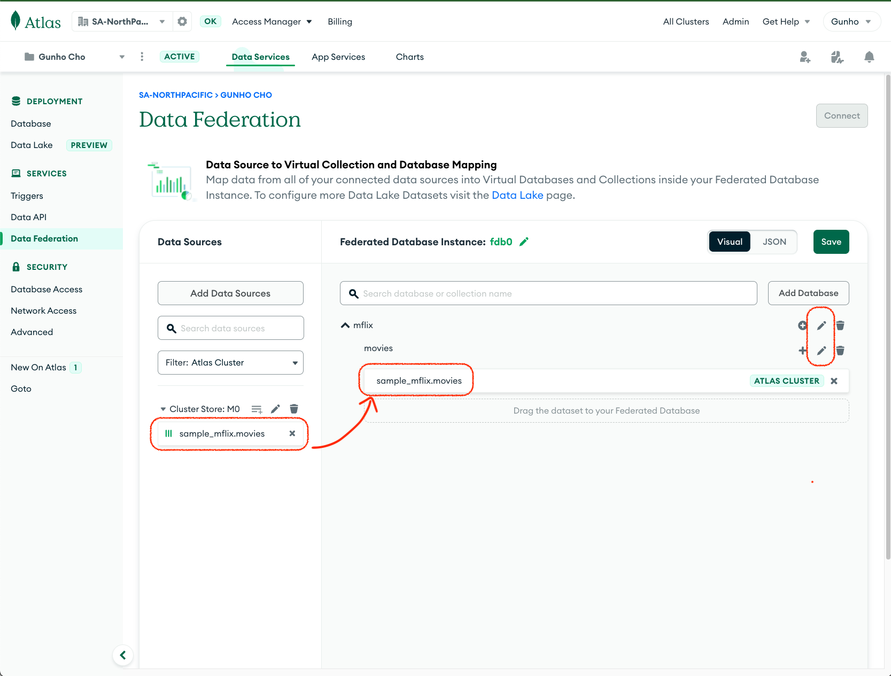

- 추가된 collection을 federated DB에 끌어서 연결
- federated instance의 database, collection 정보 변경
  - `VirtualDatabase0` &rarr; `mflix`
  - `VirtualCollection0` &rarr; `movies`

> Hot Storage를 federated DB에 연결 완료

## Cold Storage 연결

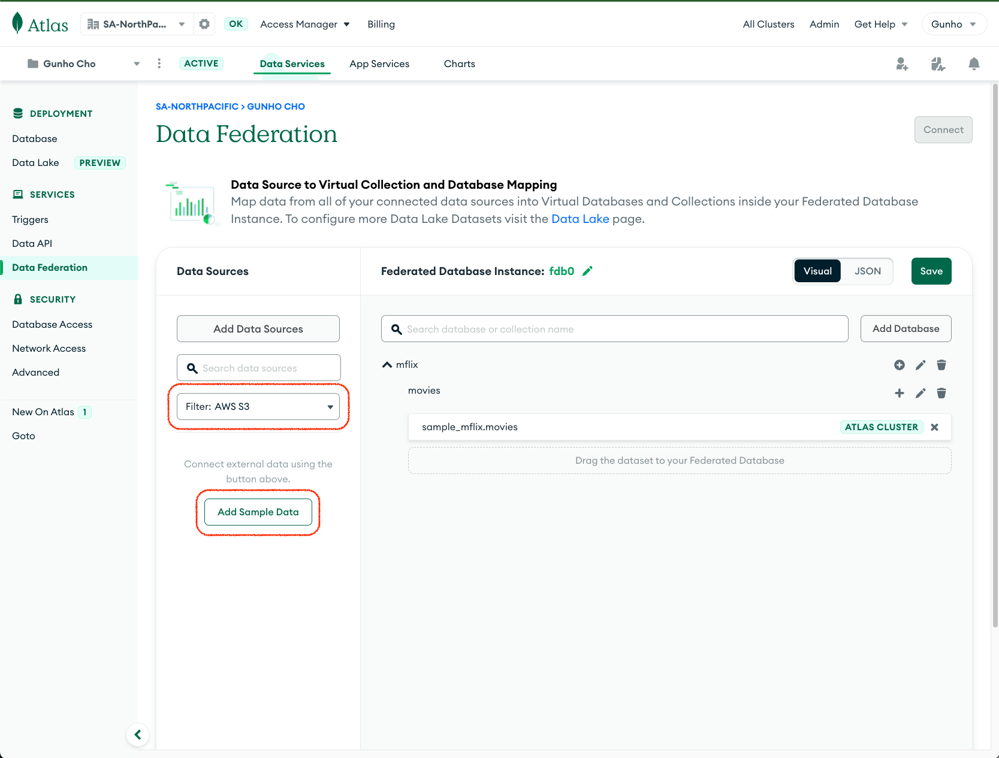

- 필터를 AWS S3로 선택
- `Add Sample Data` 클릭

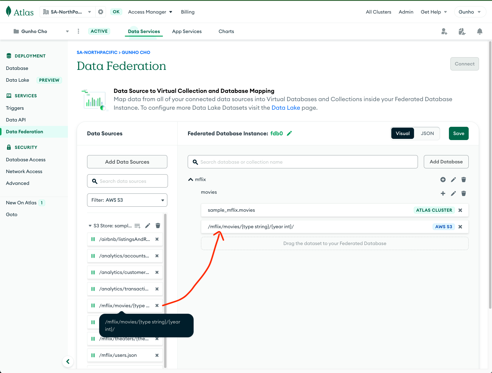

- `/mflix/movies/{type string}/{year int}/` path를 끌어서 federated DB에 연결
  > 파일은 `movies` collection의 `type`과 `year`를 partition key로 사용해 컬럼 방식으로 저장됐음을 알수 있다.  
  > 이러한 컬럼 파티션 저장 방식은 object storage 검색 성능을 향상시킬수 있으며
  > Data Lake 나 Online Archive 생성 시 파티션 키 선택에 적용할 수 있다.
- `Save` 클릭

> Cold Storage를 federated DB에 연결 완료

## Federated Query 시험

### 준비

> 연결한 두 스토리지는 모두 동일한 data set을 제공하고 있어  
> Federated Query의 동작확인을 위해 hot storage인 cluster내의 데이터를 변경 후
> 검색을 하기 위한 준비이다. 그렇지 않으면 query는 중복 데이터를 반환한다.

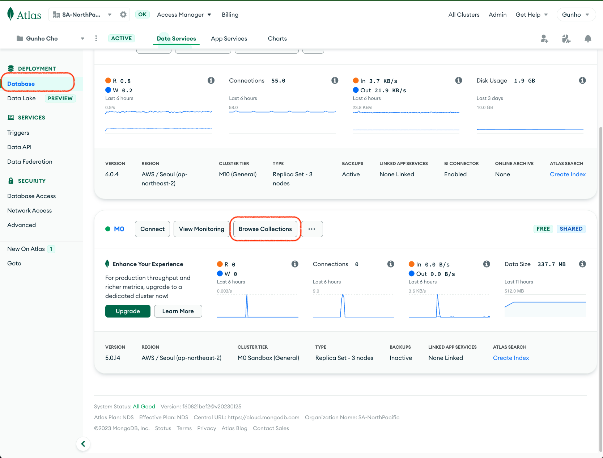

- `Database` 메뉴로 이동하여 `Browse Collections` 클릭

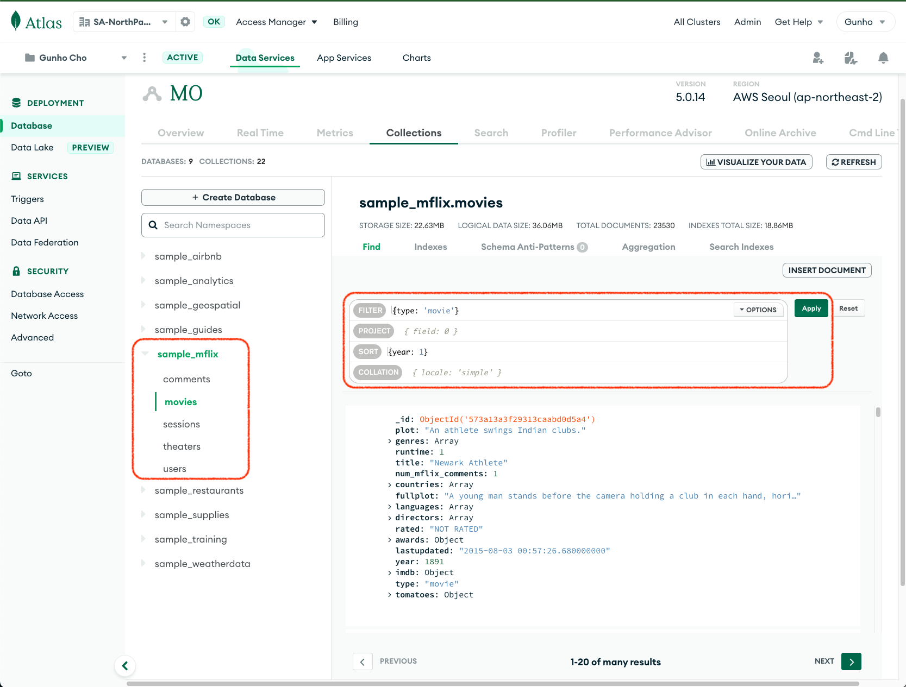

- `sample_mflix.movies`에서 `find({type: 'movie'}).sort({year: 1})`을 실행 후 결과 확인

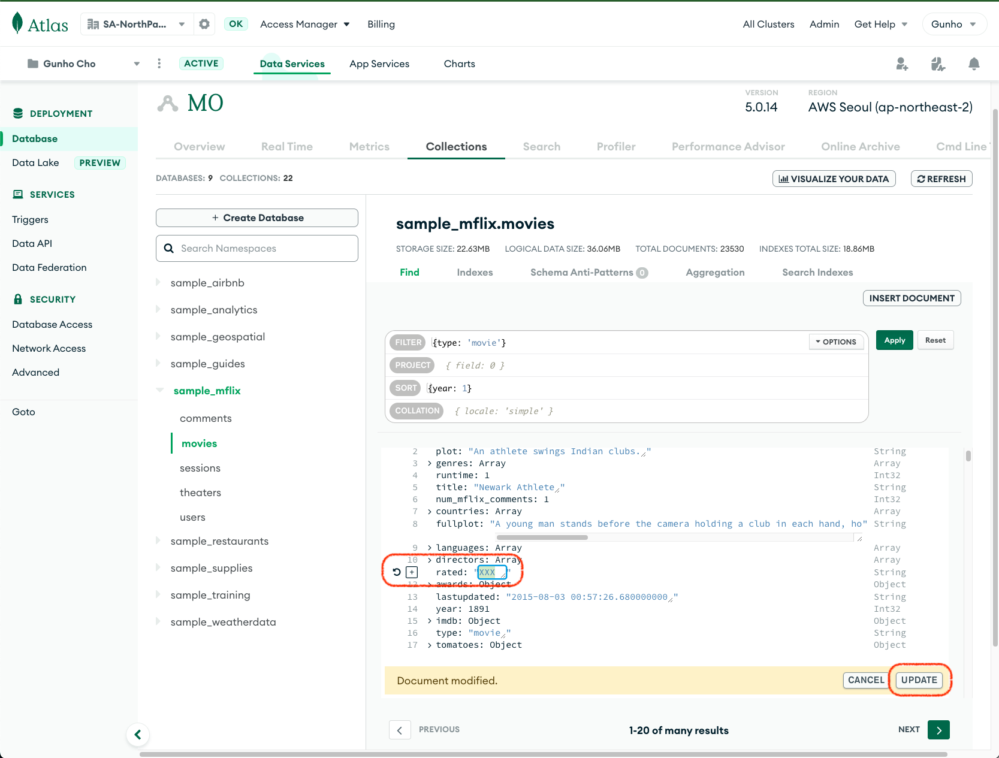

- 임의의 필드 값을 변경 후 `UPDATE` 클릭

  > 예) `rated` &rarr; `XXX`

### Query Federated DB


- `Data Federation` 메뉴로 이동하여 `Connect` 클릭

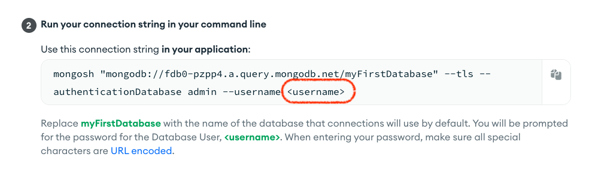

- 사용할 클라이언트 선택 후 connection string copy
  > 예) mongosh  
  > 앱에서 사용 시 `<username>` 변경 필요

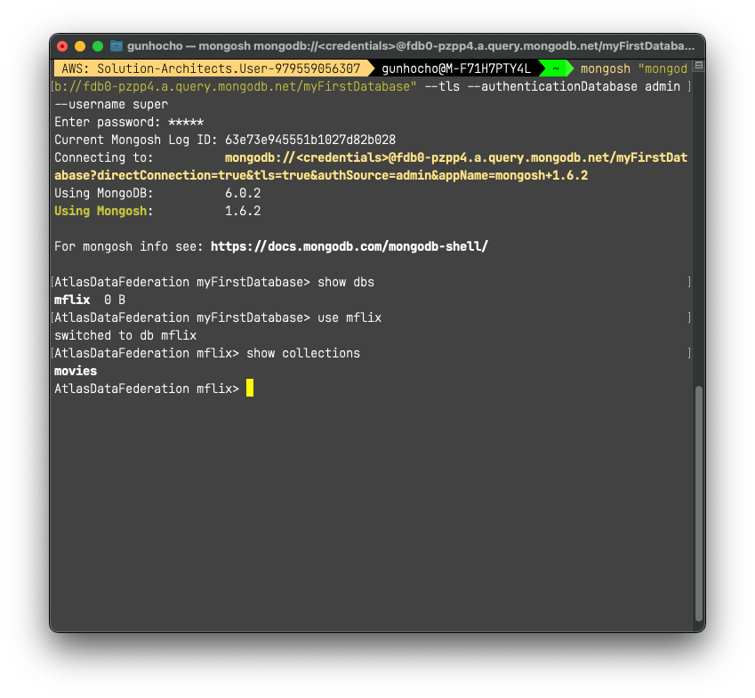

- 연결 후 federation의 database와 collection 확인

  ```
  > show dbs
  > use mflix
  > show collections
  ```

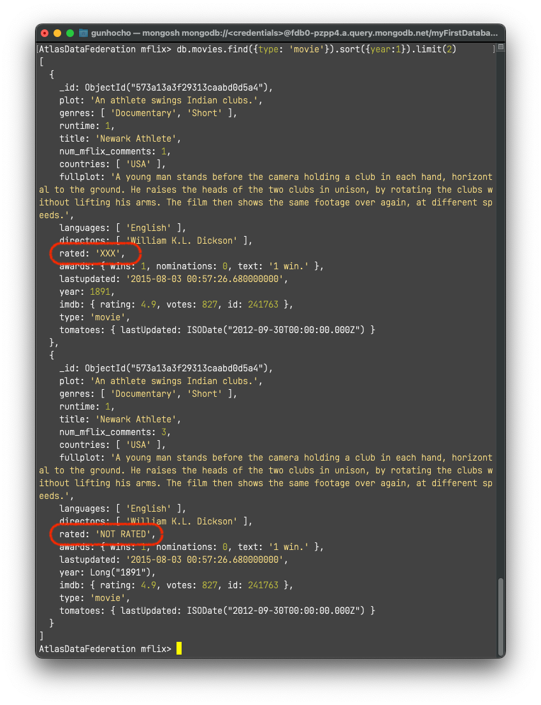

- 동일한 query를 사용해 2개의 document가 검색되는 것을 확인
  ```
  db.movies.find({type: 'movie'}).sort({year: 1}).limit(2)
  ```
  > cluster에서 수정한 `rated`필드의 값이 `XXX` 변경된 것과  
  > S3에서 가져온 원본 데이터 `NOT RATED`를 갖는 동일한 document를 확인할 수 있다.  
  > 두 document의 `_id`가 동일

### Query S3 Only

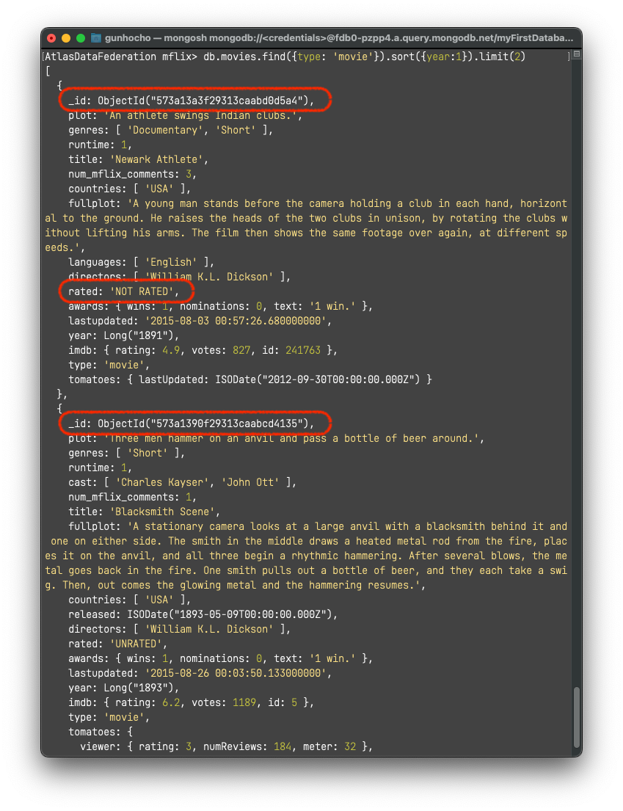

- Federation에서 cluster를 제거 후, cold storage인 S3만 남겨두고 동일한 query 실행
  ```
  db.movies.find({type: 'movie'}).sort({year: 1}).limit(2)
  ```
  > cluster에 존재하는 document는 검색이 안되는 것을 확인할 수 있다.  
  > S3에 존재하는 원본 `NOT RATED` document와  
  > 다음 순서로 검색되는 새로운 document만 결과에서 확인할 수 있다.

# Online Archive

- [Online Archive 생성](#online-archive-생성)
- [아카이빙 완료 클러스터 검색](#아카이빙-후-클러스터-검색)
- [Archive Federation Query](#archive-federation-query)

**Note**: M10 이상 티어에서 제공

> [ [Online Archive 공식 매뉴얼](https://www.mongodb.com/docs/atlas/online-archive/configure-online-archive/) ]

## Online Archive 생성

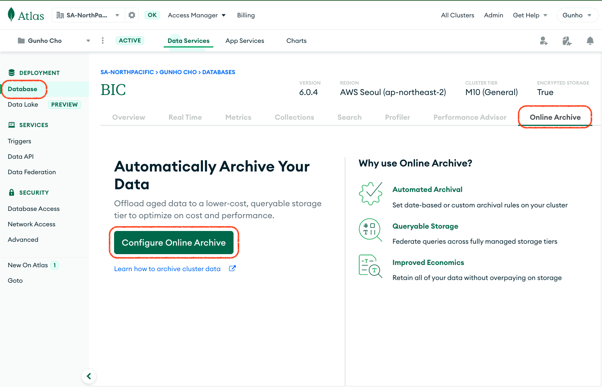

- `Database` 메뉴에서 `Browse Collections` 선택 후 `Online Archive` 탭 선택
- `Configure Online Archive` 클릭
- 이 후 보여주는 간단한 소개 페이지에서 `Next` 클릭

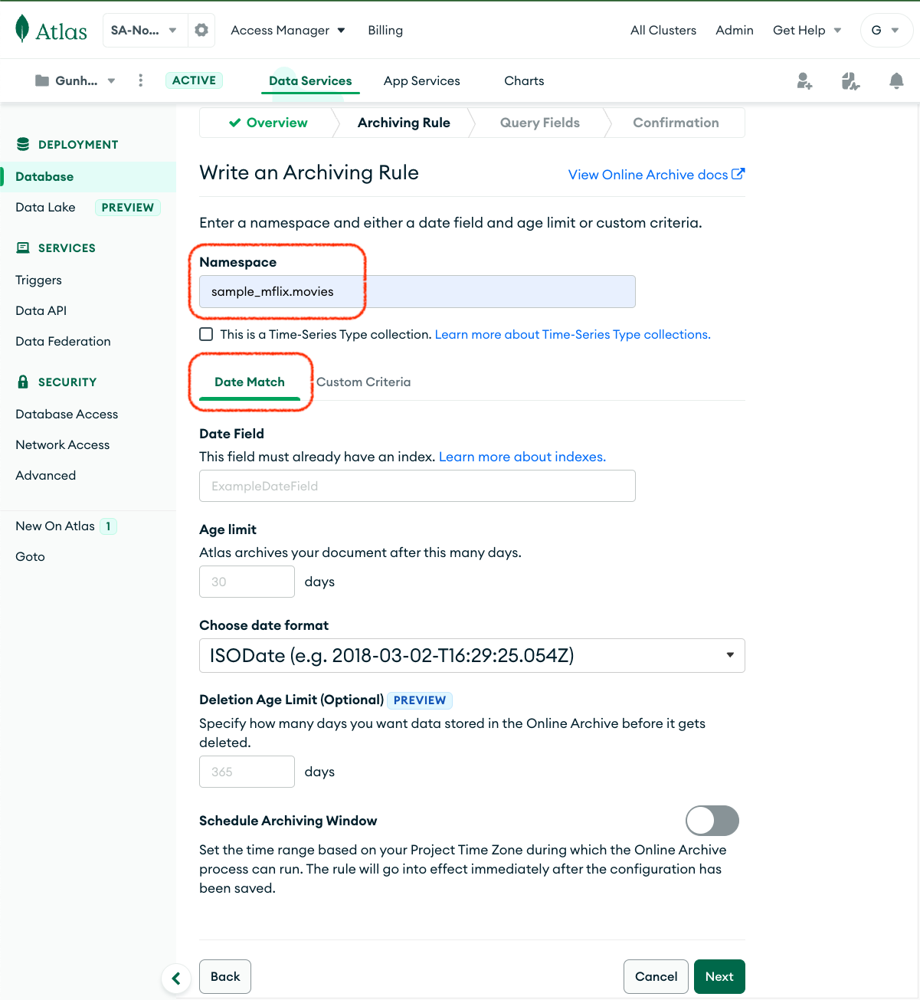

- `Namespace`에 Federation 실습에서 사용했던 `sample_mflix.movies` 입력

- `Date Match`는 document의 time field를 기준으로 아카이빙 여부를 결정한다

  - `Date Field`: 아카이빙 결정 기준으로 사용할 time field
  - `Age limit`: time field와 현재 시간을 비교하여 아카이빙에 포함시킬 기준 경과 시간
  - `Choose date format`: ISODate, Epoch sec, Epoch ms, Epoch ns 중 하나
    > 테스트에서는 `Custom Criteria`를 사용하기로 한다

- `Deletion Age Limit`: 데이터 유지정책에 따라 데이터를 완전히 삭제할 아카이빙 후 보유 시간
- `Schedule Archiving Window`: Online Archive의 기본 동작은 임의의 시간 주기적인 아카이빙이지만 cluster가 덜 바쁜 특정 시간대를 선택해 아카이빙을 실행할 수 있다

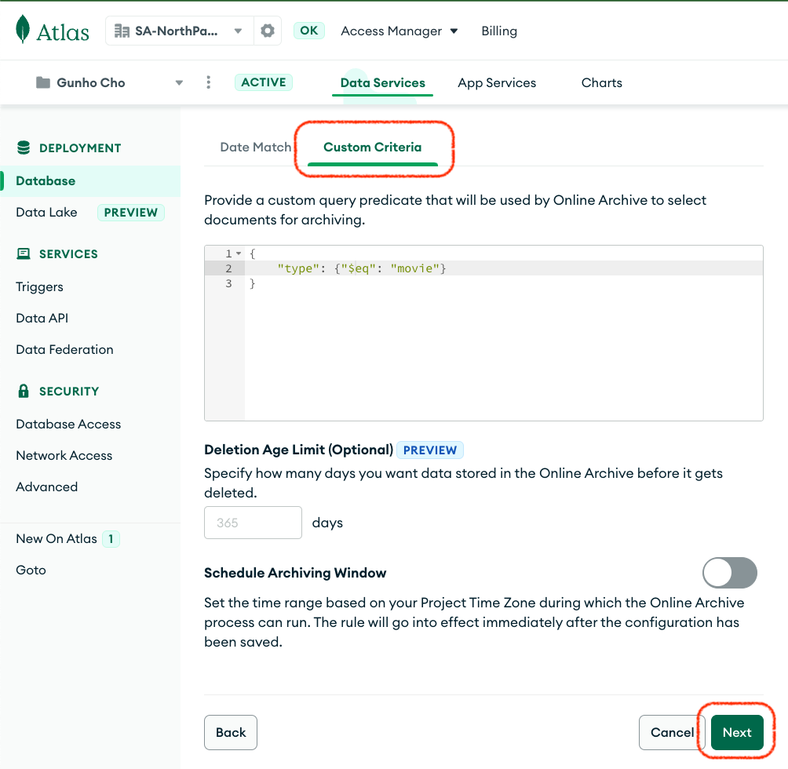

- `Custom Criteria` 탭을 선택 후
- 아카이빙에 포함할 document검색에 사용될 query 정의
  ```
  {
    "type": {"$eq": "movie"}
  }
  ```
  > `type` 값이 `movie` 인 document만 아카이빙
- `Next` 클릭

  > 아카이빙의 기준이 될 필드는 반드시 인덱스가 정의돼 있어야 한다.  
  > 필드에 인덱스가 중분치 않을 경우 `Index Sufficiency Warning` 프로젝트 에러가 발생한다.  
  > [ [가이드의 노트참조](https://www.mongodb.com/docs/atlas/online-archive/configure-online-archive/#create-an-archiving-rule-by-providing-the-following-information) ]

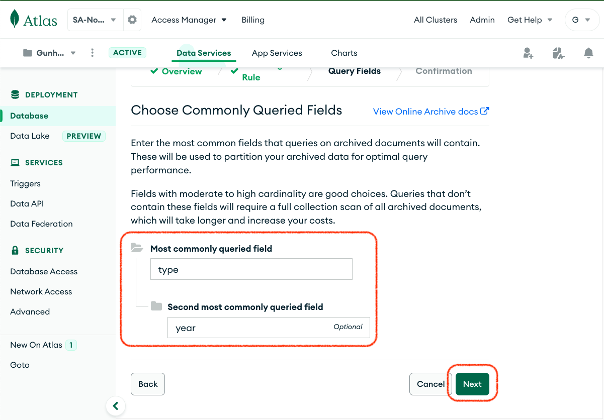

- document를 object storage에 저장할 때 사용할 파티션 키 지정
  > Federation 실습에서 사용했던 S3 데이터와 동일하게 `type`과 `year` 사용
  >
  > partition key는 document를 파일로 저장할 때 tree구조 path의 노드로 사용되기 때문에  
  > 검색에 사용할 query pattern에 맞춰 키와 순서를 정해야 검색 성능을 최적화할 수 있다.
- `Next` 클릭

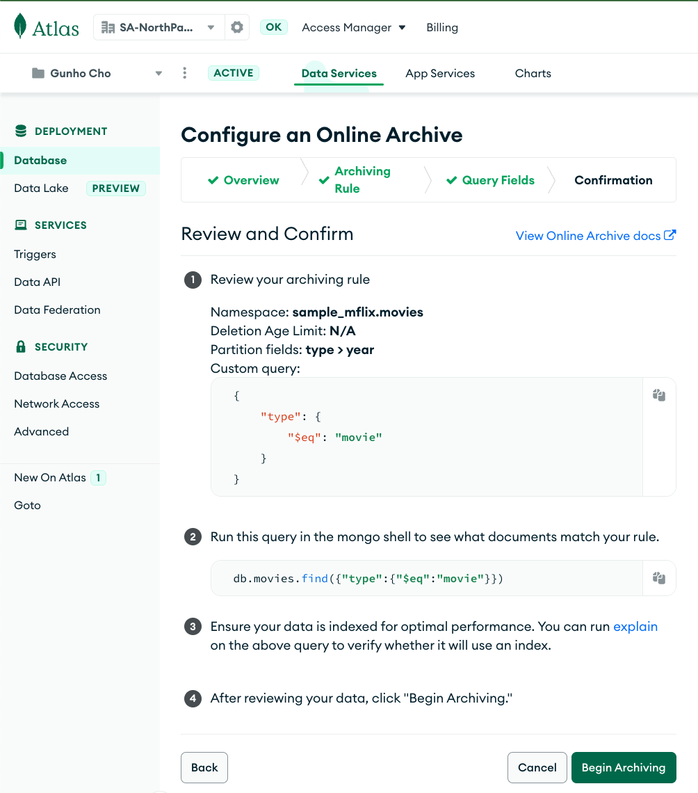

- rule 리뷰 후 `Begin Archiving` 클릭
- `Confirm` 클릭

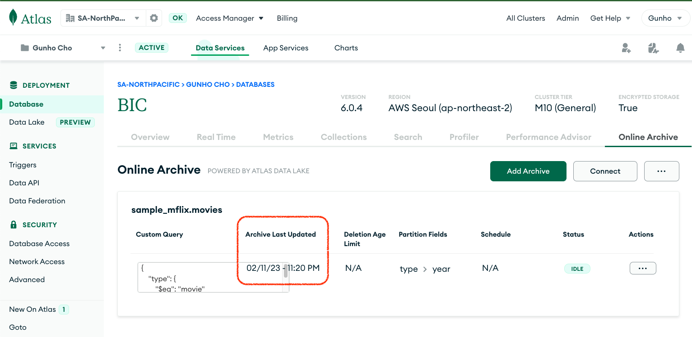

- `Archive Last Updated`에서 최종 아카이빙 마지막 시간을 확인할 수 있다

## 아카이빙 후 클러스터 검색

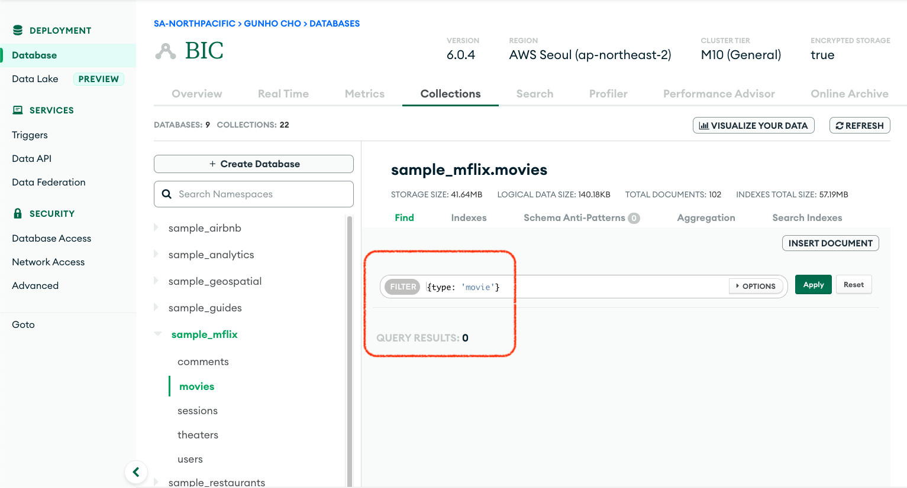

- `Collections` 탭에서 아카이빙된 document 검색을 시도하면 `QUERY RESULTS: 0`을 확인할 수 있다

## Archive Federation Query

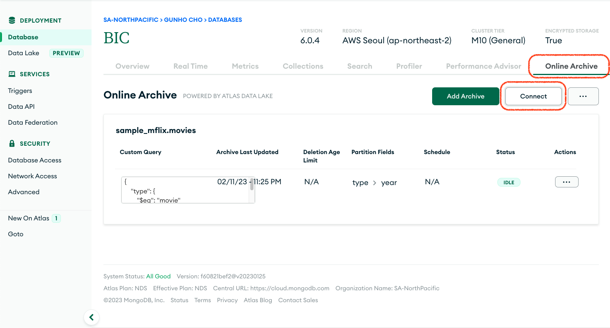

- `Online Archive`에서 `Connect` 클릭 후
- 사용할 클라이언트 선택 (예: mongosh)

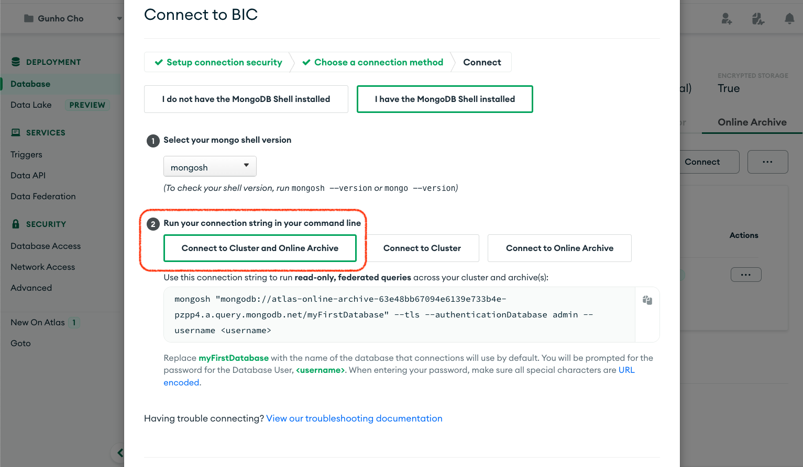

- `Connect to Cluster and Online Archive` 선택 후 URL 복사
  > client에서 사용 시  
  > `myFirstDatabase`와 `<username>`은 변경 필요

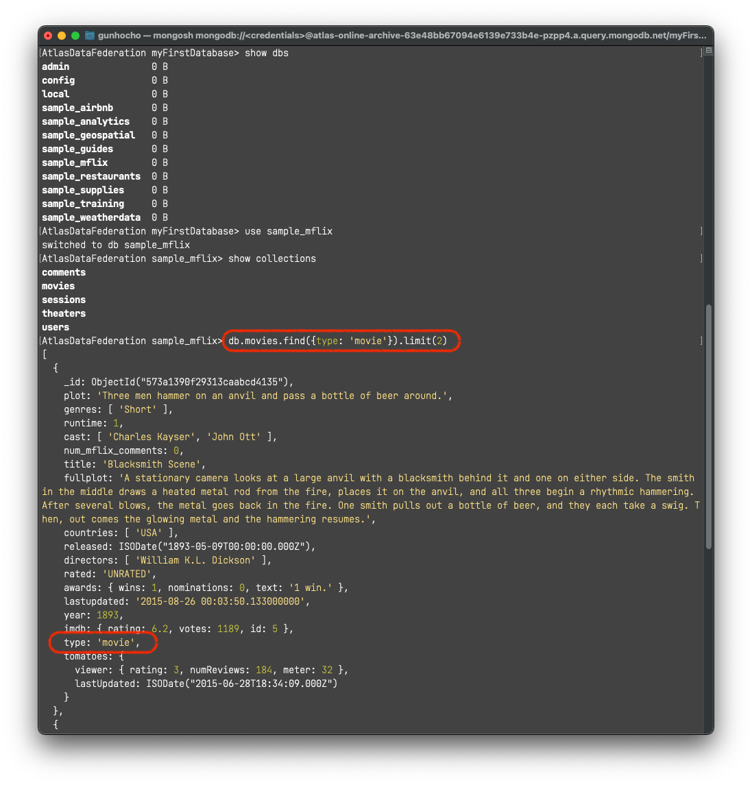

- Federation query 실행 시 cluster에서 제거된(migrate to archive) document가 검색된 것을 확인할 수 있다
