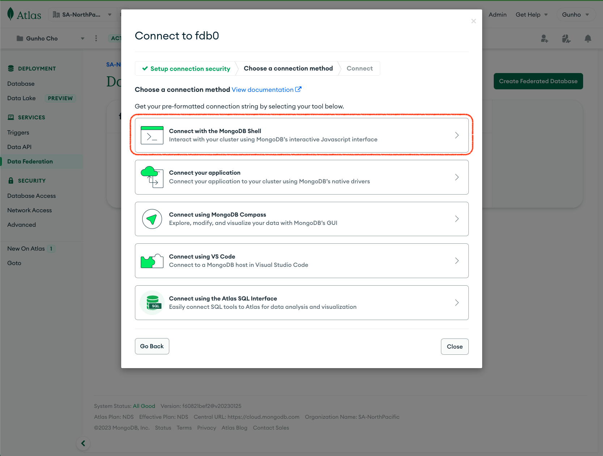

# Data Federation & Online Archive Hands-on

- [Data Federation](#data-federation)
- [Online Archive](#online-archive)

# Data Federation

- [Federation Instance 생성](#federation-instance-생성)
- [Hot Storage 추가](#hot-storage-추가)
- [Cold Storage 추가](#cold-storage-추가)
- [Federated Query 시험](#federated-query-시험)

> [ [Data Federation 공식 매뉴얼](https://www.mongodb.com/docs/atlas/data-federation/overview/) ]

## Federation Instance 생성


- [Atlas UI](https://cloud.mongodb.com) 로그인 후 왼쪽 `SERVICES` 메뉴의 `Data Federation` 으로 진입


- `Create Federated Database` 클릭


- Instance 정보 변경
  - `FederatedDatabaseInstance0` 이름 변경
    > 예) `fdb0`
- `Add Data Sources` 클릭

## Hot Storage 연결


- `Atlas Cluster` 선택
- 운영중인 클러스터 선택
- 클러스터 내의 database와 collection 선택 (예: `sample_mflix.movies`)
  > 샘플 데이터 준비는 [pre-work](https://github.com/MongoDBAtlas/MongoDBAtlasTraining/tree/main/00.pre-work#%EC%B4%88%EA%B8%B0-%EB%8D%B0%EC%9D%B4%ED%84%B0-%EB%A1%9C%EB%93%9C) 참조
- `Next` 클릭


- 추가된 collection을 federated DB에 끌어서 연결
- federated instance의 database, collection 정보 변경
  - `VirtualDatabase0` &rarr; `mflix`
  - `VirtualCollection0` &rarr; `movies`

> Hot Storage를 federated DB에 연결 완료

## Cold Storage 연결


- 필터를 AWS S3로 선택
- `Add Sample Data` 클릭


- `/mflix/movies/{type string}/{year int}/` path를 끌어서 federated DB에 연결
  > 파일은 `movies` collection의 `type`과 `year`를 partition key로 사용해 컬럼 방식으로 저장됐음을 알수 있다.  
  > 이러한 컬럼 파티션 저장 방식은 object storage 검색 성능을 향상시킬수 있으며
  > Data Lake 나 Online Archive 생성 시 파티션 키 선택에 적용할 수 있다.
- `Save` 클릭

> Cold Storage를 federated DB에 연결 완료

## Federated Query 시험

### 준비

> 연결한 두 스토리지는 모두 동일한 data set을 제공하고 있어  
> Federated Query의 동작확인을 위해 hot storage인 cluster내의 데이터를 변경 후
> 검색을 하기 위한 준비이다. 그렇지 않으면 query는 중복 데이터를 반환한다.


- `Database` 메뉴로 이동하여 `Browse Collections` 클릭


- `sample_mflix.movies`에서 `find({type: 'movie'}).sort({year: 1})`을 실행 후 결과 확인


- 임의의 필드 값을 변경 후 `UPDATE` 클릭

  > 예) `rated` &rarr; `XXX`

### Query Federated DB



- `Data Federation` 메뉴로 이동하여 `Connect` 클릭


- 사용할 클라이언트 선택 후 connection string copy
  > 예) mongosh  
  > 앱에서 사용 시 `<username>` 변경 필요


- 연결 후 federation의 database와 collection 확인

  ```
  > show dbs
  > use mflix
  > show collections
  ```


- 동일한 query를 사용해 2개의 document가 검색되는 것을 확인
  ```
  db.movies.find({type: 'movie'}).sort({year: 1}).limit(2)
  ```
  > cluster에서 수정한 `rated`필드의 값이 `XXX` 변경된 것과  
  > S3에서 가져온 원본 데이터 `NOT RATED`를 갖는 동일한 document를 확인할 수 있다.  
  > 두 document의 `_id`가 동일

### Query S3 Only


- Federation에서 cluster를 제거 후, cold storage인 S3만 남겨두고 동일한 query 실행
  ```
  db.movies.find({type: 'movie'}).sort({year: 1}).limit(2)
  ```
  > cluster에 존재하는 document는 검색이 안되는 것을 확인할 수 있다.  
  > S3에 존재하는 원본 `NOT RATED` document와  
  > 다음 순서로 검색되는 새로운 document만 결과에서 확인할 수 있다.

# Online Archive

**Note**: M10 이상 티어에서 제공

> [ [Online Archive 공식 매뉴얼](https://www.mongodb.com/docs/atlas/online-archive/configure-online-archive/) ]
